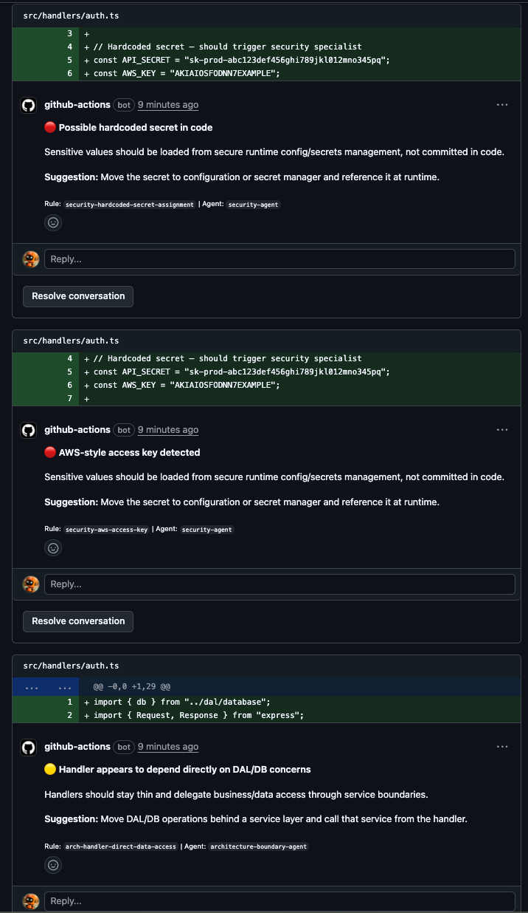

# Review Pilot

Multi-agent semantic code review that enforces security and architecture conventions — delivered as a GitHub Action.

Review Pilot goes beyond linters by analyzing pull requests through six specialist agents that detect pattern violations in security, architecture boundaries, API contracts, data access, reliability, and logging/error handling.

## How It Works

```
PR Opened → Diff Parser → Context Resolver → Diff Router
                                                  ↓
                                    ┌─────────────────────────┐
                                    │   Specialist Agents     │
                                    │                         │
                                    │  ● Security             │
                                    │  ● Architecture Boundary│
                                    │  ● API Contract         │
                                    │  ● Data Access          │
                                    │  ● Reliability          │
                                    │  ● Logging / Error      │
                                    └────────────┬────────────┘
                                                 ↓
                              Review Synthesizer → GitHub Review
```

1. **Diff Parser** — Parses PR hunks, extracts changed lines, filters ignored files
2. **Context Resolver** — Fetches full file contents and resolves imports within a token budget
3. **Diff Router** — Classifies files by kind (handler, service, DAL, model, etc.) and routes to relevant specialists
4. **Specialist Agents** — Each agent runs built-in pattern checks plus user-defined hard rules
5. **Review Synthesizer** — Deduplicates, ranks findings by severity, and builds a summary
6. **Reviewer** — Formats the review with inline comments and posts to GitHub

### Convention Mining

When a PR is merged, Review Pilot can mine coding conventions from the diff and review comments using Claude, storing them as learned rules for future reviews.

## Example Review Output

To see Review Pilot in action, open a PR that introduces code it's configured to catch. For example, a file like `src/handlers/auth.ts` that hardcodes a secret, imports a database module directly, and swallows errors in a catch block will trigger findings across multiple specialist agents for security, architecture-boundary, and logging-error.

When Review Pilot finds issues, it posts a structured review directly on the PR with inline comments:



---

**Review Pilot** — Multi-agent review found 4 issue(s): 2 critical, 2 warning, 0 info.

| Severity | Count |
|----------|-------|
| 🔴 Critical | 2 |
| 🟡 Warning | 2 |

#### 🔴 Possible hardcoded secret in code
`src/handlers/auth.ts:5` | Rule: `security-hardcoded-secret-assignment` | Category: `security` | Agent: `security-agent`

Sensitive values should be loaded from secure runtime config/secrets management, not committed in code.

> **Suggestion:** Move the secret to configuration or secret manager and reference it at runtime.

#### 🔴 AWS-style access key detected
`src/handlers/auth.ts:6` | Rule: `security-aws-access-key` | Category: `security` | Agent: `security-agent`

Sensitive values should be loaded from secure runtime config/secrets management, not committed in code.

> **Suggestion:** Move the secret to configuration or secret manager and reference it at runtime.

#### 🟡 Handler appears to depend directly on DAL/DB concerns
`src/handlers/auth.ts:1` | Rule: `arch-handler-direct-data-access` | Category: `architecture-boundary` | Agent: `architecture-boundary-agent`

Handlers should stay thin and delegate business/data access through service boundaries.

> **Suggestion:** Move DAL/DB operations behind a service layer and call that service from the handler.

#### 🟡 Catch block appears to miss error logging/propagation
`src/handlers/auth.ts:17` | Rule: `logging-catch-no-log` | Category: `logging-error` | Agent: `logging-error-agent`

New catch blocks should either log with context or rethrow to avoid silent failures.

> **Suggestion:** Add structured error logging and/or rethrow after handling.

---

## Usage

Add to your workflow:

```yaml
name: Review Pilot
on:
  pull_request:
    types: [opened, synchronize, reopened, closed]

permissions:
  contents: read
  pull-requests: write

jobs:
  review:
    runs-on: ubuntu-latest
    steps:
      - uses: actions/checkout@v4
      - uses: shaunzlim0123/review-pilot@main
        with:
          anthropic-api-key: ${{ secrets.ANTHROPIC_API_KEY }}
```

### Inputs

| Input                 | Required | Default                      | Description                             |
| --------------------- | -------- | ---------------------------- | --------------------------------------- |
| `github-token`        | No       | `${{ github.token }}`        | GitHub token for API access             |
| `anthropic-api-key`   | **Yes**  | —                            | Anthropic API key for convention mining |
| `model`               | No       | `claude-sonnet-4-5-20250929` | Model for convention mining             |
| `config-path`         | No       | `.review-pilot.yml`          | Path to config file                     |
| `policy-path`         | No       | `reviewer_policy.json`       | Path to policy snapshot                 |
| `mode`                | No       | `warn`                       | Enforcement mode: `warn` or `enforce`   |
| `max-inline-comments` | No       | `3`                          | Maximum inline comments per review      |
| `learned-rules-path`  | No       | `.review-pilot-learned.json` | Path to learned rules store             |

### Outputs

| Output           | Description                                                    |
| ---------------- | -------------------------------------------------------------- |
| `findings-count` | Total findings from review                                     |
| `critical-count` | Critical findings count                                        |
| `warning-count`  | Warning findings count                                         |
| `review-event`   | Review action posted (`APPROVE`, `COMMENT`, `REQUEST_CHANGES`) |

## Configuration

Create a `.review-pilot.yml` in your repo root:

```yaml
# Soft rules — semantic patterns described in natural language
soft_rules:
  - id: no-direct-db-in-handlers
    description: "Handlers should not import database packages directly"
    scope: "src/handlers/**"
    pattern: "No direct database imports in HTTP handlers"
    severity: warning

# Hard rules — regex-based checks enforced automatically
hard_rules:
  - id: no-console-log
    description: "Use structured logger instead of console.log"
    scope: "**/*.ts"
    pattern: "console\\.log\\("
    mode: forbid_regex
    target: added_lines
    severity: warning
    category: logging-error

# Files to ignore
ignore:
  - "**/*.generated.ts"
  - "docs/**"

# Allowlist specific paths
allowlist:
  - path: "scripts/**"
    rule_ids: ["no-console-log"]
    reason: "Scripts use console output intentionally"

# Enforcement settings
enforcement:
  mode: warn # warn | enforce
  block_on: [critical]
  new_code_only: true

# File classification overrides
file_classification:
  handler:
    paths: ["/api/", "/routes/"]
  dal:
    paths: ["/database/", "/repos/"]

# Specialist routing overrides
specialist_routing:
  handler: [security, reliability, api-contract]
```

## Specialist Agents

| Agent                     | What It Detects                                                         |
| ------------------------- | ----------------------------------------------------------------------- |
| **Security**              | Hardcoded secrets, AWS keys, private key material, generated file edits |
| **Architecture Boundary** | Cross-layer imports, handler-to-DAL coupling violations                 |
| **API Contract**          | Missing validation, inconsistent response shapes                        |
| **Data Access**           | Raw SQL in non-DAL layers, missing transaction handling                 |
| **Reliability**           | Unhandled promises, missing error boundaries, resource leaks            |
| **Logging / Error**       | Swallowed errors, missing contextual logging, bare `catch` blocks       |

## Development

```bash
# Setup
python -m venv .venv
source .venv/bin/activate
pip install -e ".[dev]"

# Run tests
pytest

# Type checking
mypy src/

# Linting
ruff check src/ tests/
```

## Project Structure

```
src/review_pilot/
├── __main__.py              # Entry point (python -m review_pilot)
├── models.py                # Pydantic data models
├── config.py                # YAML config + learned rules loader
├── diff_parser.py           # Hunk parsing and line extraction
├── context_resolver.py      # File content fetching and import resolution
├── reviewer.py              # Review formatting and GitHub posting
├── policy/
│   ├── load_policy.py       # Policy loading orchestrator
│   └── merge_policy.py      # Rule merging strategy
└── agents/
    ├── orchestrator.py      # Specialist pipeline runner
    ├── diff_router.py       # File classification and routing
    ├── review_synthesizer.py # Finding dedup and ranking
    ├── convention_miner.py  # Learned rule extraction via Claude
    ├── language_detector.py # Extension-based language detection
    └── specialists/
        ├── registry.py      # @specialist decorator registry
        ├── common.py        # Shared utilities and hard rule engine
        ├── security.py
        ├── architecture_boundary.py
        ├── api_contract.py
        ├── data_access.py
        ├── reliability.py
        └── logging_error.py
```

## License

MIT
